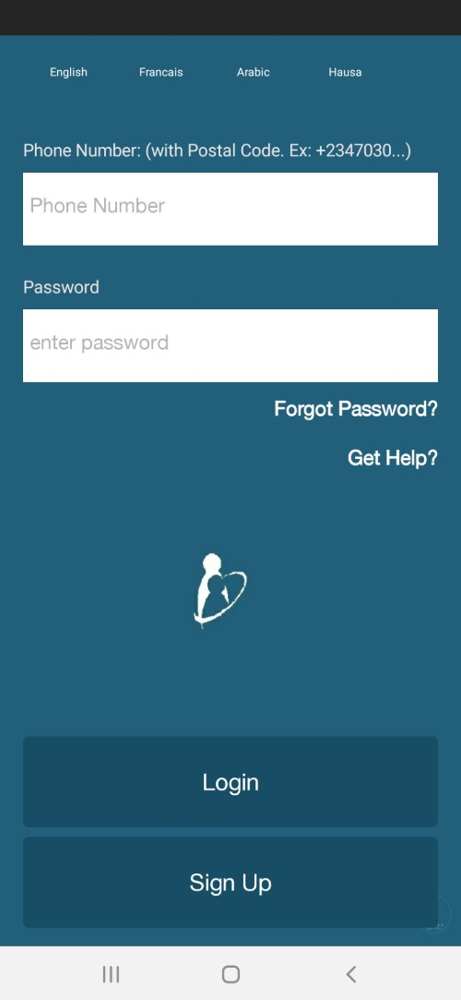
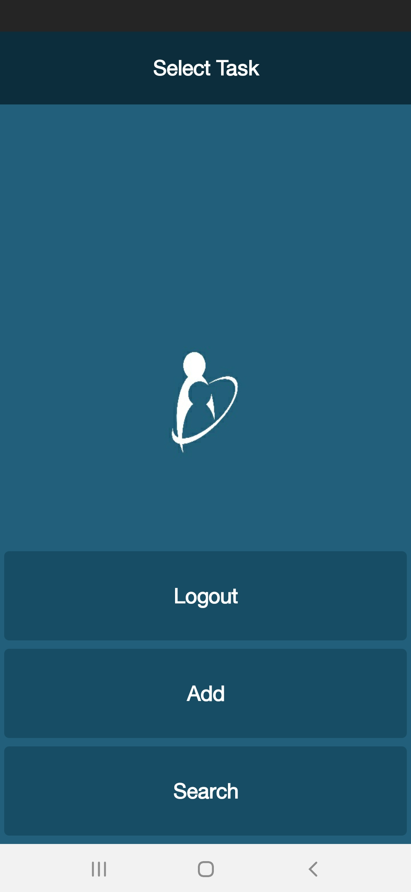
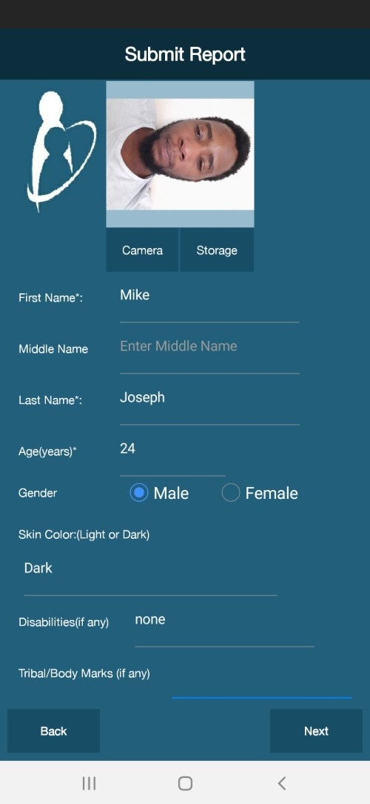

# Kin-Reunifier-Android-App-Demo
We have developed an Android App that utilises facial recognition tech to identify IDPs in Borno state. See screenshots below. The app is great for datalogging and facial identification. This app is based on Visual Basic (B4A).

# Logo

## Login Screen

## Home

## Add record

## Search for someone

